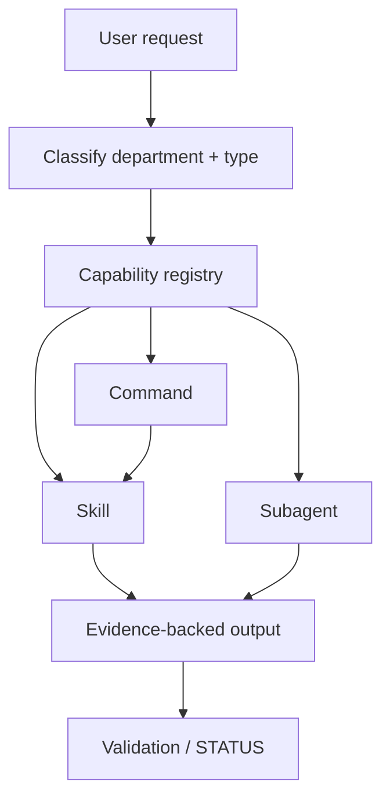

# Architecture Overview

Command Tower Company OS layers:

1. **Governance** — CLAUDE.md, COMPANY_OS.md, SECURITY_POLICY.md, PROJECT_TRUTH.md
2. **Registries** — CAPABILITY_REGISTRY.yaml + human registries
3. **Runtime surface** — `.claude/skills|agents|commands|settings.json`
4. **Departments** — `company/<dept>/` ownership maps
5. **Validation** — `scripts/validate/validate_company_os.py` + `tests/**/fixtures.json`
6. **Installation** — bootstrap/uninstall without touching unrelated user config

See `COMPANY_OS.md` for routing rules.
